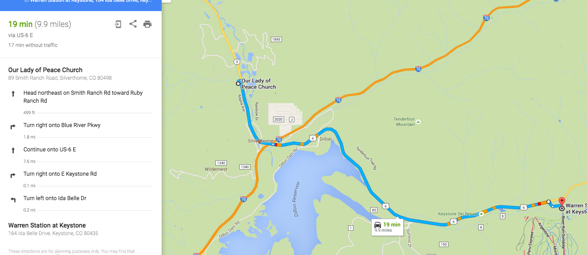

---
output:
  html_document:
    toc: true
    toc_float: true
---

### Contact
For any questions contact Madison Kellar at madi.kellar@gmail.com.


### Where is the wedding?
The wedding will be taking place at [Our Lady of Peace](http://www.summitcatholic.org/our-lady-of-peace-silverthorne/).

Our Lady of Peace:
89 Smith Ranch Rd
Silverthorne, CO 80498


### When is the wedding?
The wedding is Saturday January 7th, 2017. The ceremony begins at 2:00pm, please plan on arriving a half hour early. It takes about *two hours* to get to Silverthorne from Denver but check [CDOT](http://www.cotrip.org/highways.htm#?commuteRouteId=54) for traffic and weather.

### A Catholic wedding?

A Catholic wedding is about an hour and a half long, and includes a mass with Holy Communion.

Communion?

As Catholics, we fully participate in the celebration of the Eucharist when we receive Holy Communion. If you are Catholic, we encourage you to come recieve Communion with us. In order to be properly disposed to receive Communion, participants should not be conscious of grave sin and normally should have fasted for one hour. A frequent reception of the Sacrament of Penance is encouraged for all who are receiving Communion.

We of course welcome all, and are delighted you have come to celebrate with us. However, because Catholics believe that the celebration of the Holy Eucharist is the Body and Blood of Christ, members of those churches with whom we are not yet fully united are ordinarily not admitted to Holy Communion.

For those not recieving Holy Communion, you may remain in your seat during Holy Communion, or come forward with your arms crossed over your chest to receive a blessing.

### Where is the wedding reception?
The wedding reception will be at [Warren Station](http://www.warrenstation.com/) at Keystone.

Warren Station:
164 Ida Belle Dr.
Keystone, CO 80435

Follow signs for the free skier parking in the River Run parking lot. Park on the West end of the lot. Warren station is a permanent white tent structure just west of the main village. (If you reach the gondala, you've gone too far!)

### When is the reception?
The reception begins at 4:30pm and ends at 8:30pm.

### How do I get from the wedding to the reception?

Follow this [map](https://www.google.com/maps/dir/Our+Lady+of+Peace+Church,+Smith+Ranch+Road,+Silverthorne,+CO/Warren+Station+at+Keystone,+Ida+Belle+Drive,+Keystone,+CO/@39.6256517,-106.0465285,13z/am=t/data=!3m1!4b1!4m13!4m12!1m5!1m1!1s0x876a5b77f3d4c15b:0x447cb6290e629536!2m2!1d-106.080912!2d39.6485228!1m5!1m1!1s0x876a57349583c011:0x5ed51bb876538235!2m2!1d-105.941881!2d39.607108)

```{r, out.width = 1800, out.height=2000, echo=FALSE}

```

### Where is lodging for out-of-town guests?
We have reserved rooms at the Ptarmigan Lodge Best Western (652 Lake Dillon Drive Dillon, CO 80435). To reserve a room, contact Ptarmigan Lodge at (970)468-2341 and mention that you are coming for the Lopp/Kellar Wedding. Discounted rates are as follows:


....

### How do I get from the airport to the hotel in Silverthorne?

We recommend renting a car, but guests can also get from DIA to Silverthorne via the [Colorado Mountain Express Shuttle](https://www.coloradomountainexpress.com/summit-county) (reservations required.)


### How do I RSVP?
Go to the RSVP [site](http://seandemo.shinyapps.io/elopped), or send us the RSVP card that came with your invitiation.

### How do I change my RSVP?
Contact Madison (madi.kellar@gmail.com) or Sean (lopp.sean@gmail.com).
