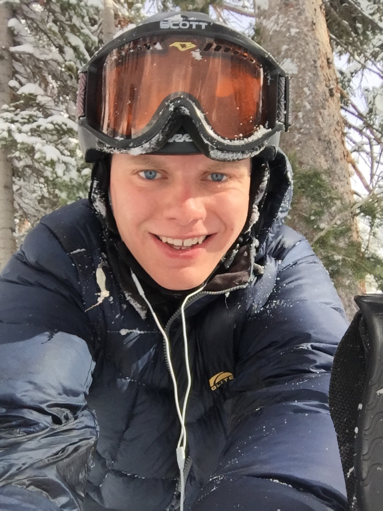

## Sean Lopp
```{r, out.width = 100, out.height=150, echo=FALSE}

```


## Madi Kellar
Madison graduated from Colorado School of Mines in May with a B.S. in Applied Math. She is on her way to becoming a high school math teacher through the BOettcher Teacher Residency. She is currently in school for her Masters in Education and student teaches in Thornton, CO.

## Lopp Family


## Kellar Family
Jeff and Diane are both from Minnesota, don't-cha-know.  They met in high school.  Jeff moved to Washington to work as an engineer for the Boeing Company after graduating from North Dakota State University.  They had a December wedding in Fargo, ND, so Madison is continuing the cold and snowy wedding tradition. Afterwards, Diane moved to Washington and completed her BS at University of Washington.  She also went to work for the Boeing Company after graduation.  They have lived just south of Seattle, in Federal Way, ever since. After most people had given up on them ever having children, Alyssa was born.  She was so much fun Jeff and Diane decided to have another and in 1994 Madison was born.  Both girls are the joy of their life!  Jeff continues to work for the Boeing Company.  Diane went back to school for her Master's in Business Admininstration and continued to work for Boeing until 1997 when she decided to stay home and play with the girls.  Today she is an obsessed quilter.  Jeff loves to sail, make things on his lathe and make beer in his spare time.  Alyssa also resides in Washington and is a music teacher. They miss Madison and constantly beg her to visit and so they buy a lot of plane tickets. Jeff and Diane hope to buy an RV and retire soon, spending time in both Washington and Colorado to see their girls.  They are thrilled Madison has found a nice Catholic boy! 
